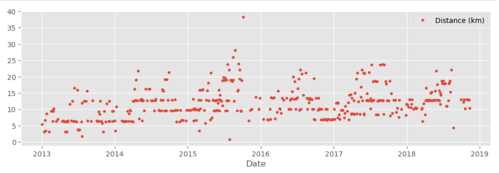
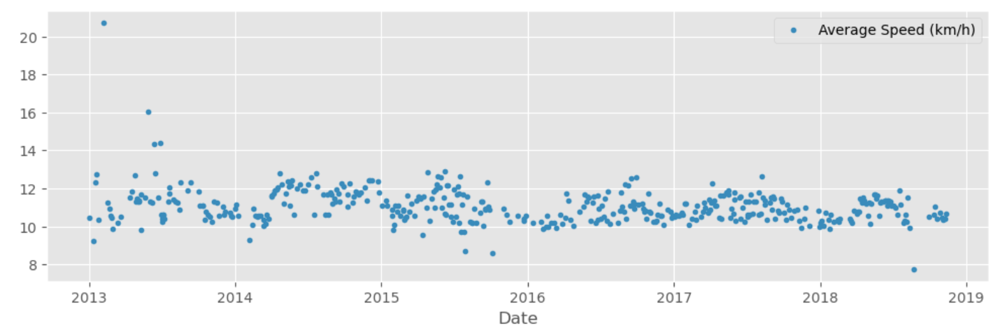
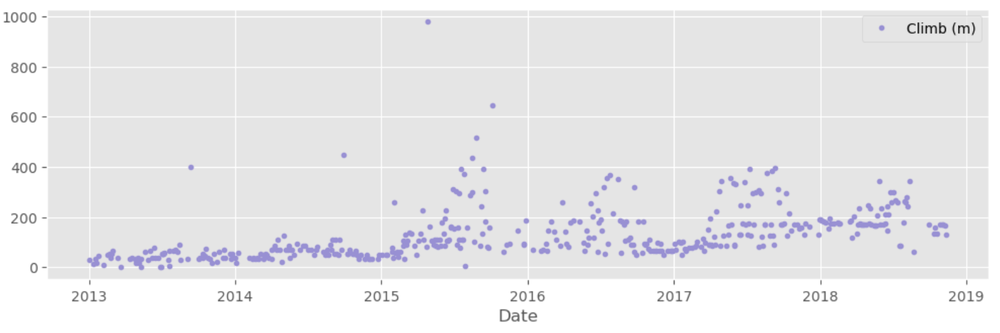
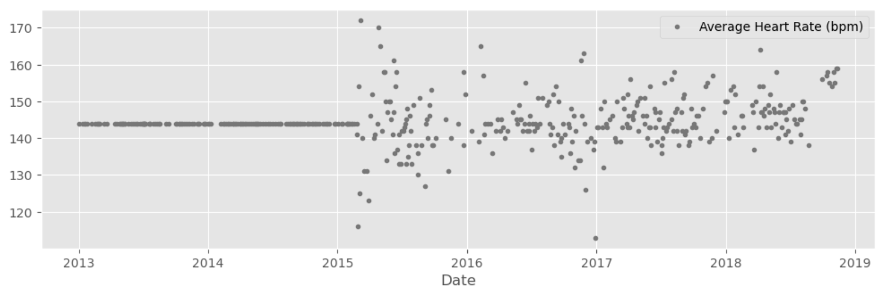
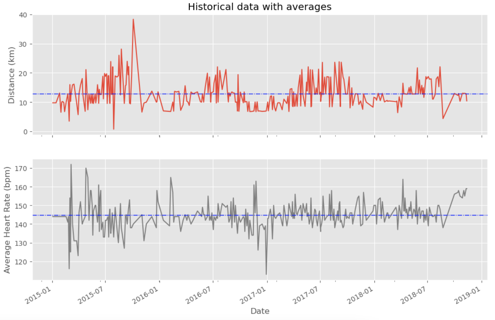
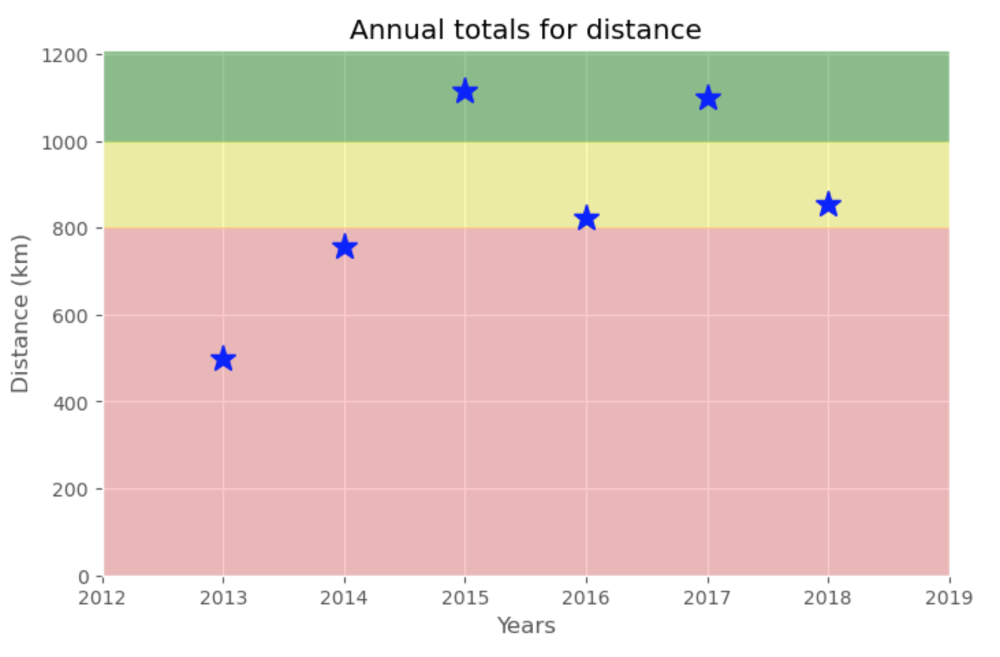

# Analyzing Runkeeper App Data

- Kevin Barnett

## Business Problem
Analyze a runner's data from the popular running app 'Runkeeper' and report insights about their training habits, style, and performance trends/achievements. The runner has specifically requested to find out: has reached his goal of running 1000km per year, how is he progressing, and what his training intensity is.

## Data Methodology
1. Gather Data
2. Data Cleaning
3. Exploratory Data Analysis
4. Detailed Statistical Summary

## Gathering Data
The runner was able to supply the data from the 'Runkeeper' app by downloading and sending the data in a .csv file format.

## Data Cleaning
After loading the data into a pandas dataframe the follow steps were completed to clean the data:
    - Columns that were not relevant to the analysis were dropped
    - 'Other' column was renamed to 'Unicycling'
    - Averages of the columns were used to fill missing data points

## Exploratory Data Analysis
The dataframe was masked to subset data between 2013-2018. 

### Features Vs. Date Scatter Plots

> Plotting several features versus date begins to show trends in the data. In the heart rate visualization we can see the runner did not capture any data before 2015 (all the data has been imputed with the average heart rate). Next I made visualizing the trends easier

### Historical Data Trends with Average Line
Since there was no relevant heart rate data captured before 2015 the data was masked again to subset 2015-2018

> The average distance of the runner was just over 10km and the average HR was ~145bpm. From late 2017-2018 we can see overall less HR variability during the runs. The highest HRs seem to be during shorter runs.

### Did the runner reach his goal of running 1000km/year?

> from 2013-2018 the goal of 1000km per year was reached twice (2015 & 2017).
